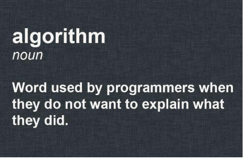

# Leetcode Solutions

This repo contains all my Leetcode solutions using Java and JavaScript(update later). Solving the Leetcode problems reminds me of doing math excecises during my high school. My math teacher always assign us a few math excecises filtered by him in a lot of math test paper. It is so easy to find the solutions on Internet. But spending much time for me to try for it helper me a lot. It is meaningless to consider the standard answer for a few minutes and copy it.

So if you want to see the answer with the least time complexity and space complexity. I am so sorry. But if you want to see how to solve the problem from the beginning and finally find the best way to solve it. Here might be the shits you want to see.

:calendar::book::airplane:

### Some funny things

### Contribution

This section is just for fun. If you find any analyze wrong or have better way to explain. Please make a PR to me!

### Future

Hope I can find the life meaning in the process!
